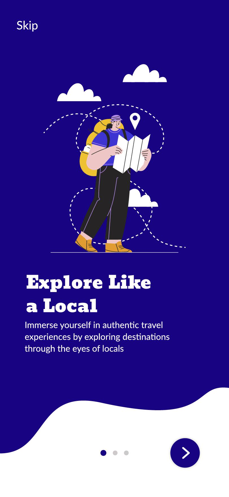
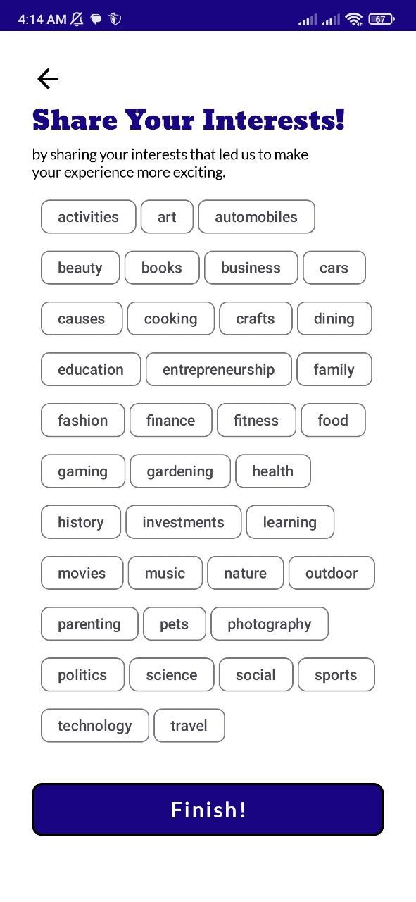
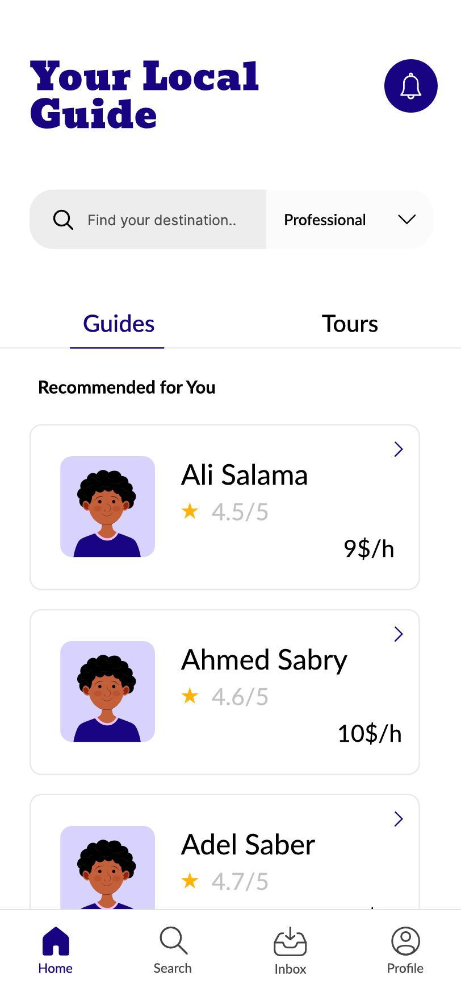
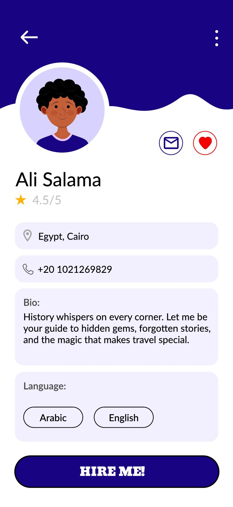
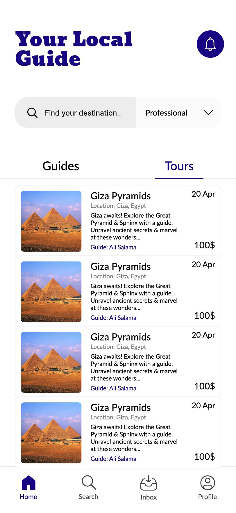
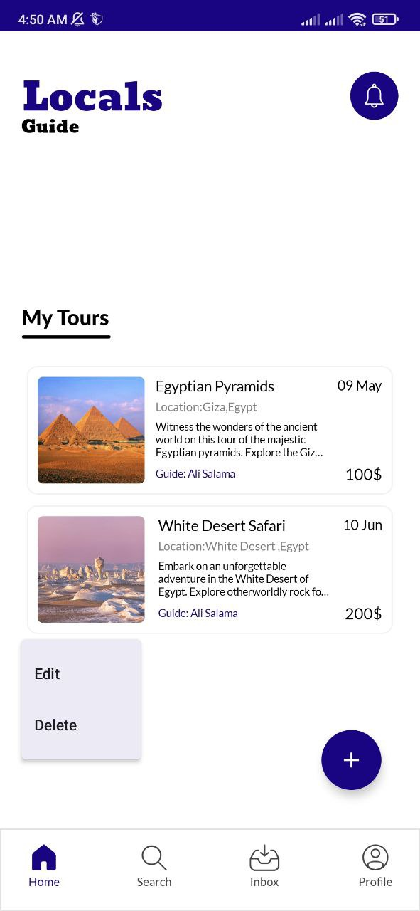
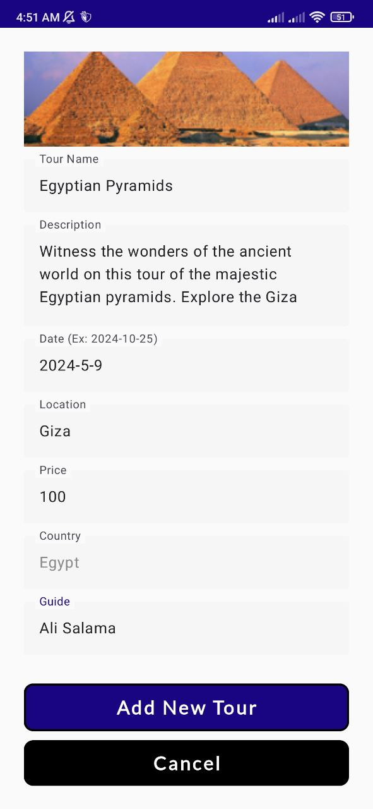

# Local Guide App 🗺️

[](https://android.com)
[](https://kotlinlang.org)
[](https://developer.android.com/jetpack/compose)
[](https://firebase.google.com)

> **A revolutionary Android app that connects travelers with authentic local guides, fostering genuine cultural connections and enriching travel experiences.**

---

## 📱 Overview

LocalGuide is more than just a tour guide app—it's a platform that bridges the gap between tourists seeking authentic experiences and local guides who know their cities like the back of their hand. Built with modern Android technologies, the app leverages AI-powered recommendations to create personalized travel experiences.

### 🎯 Core Philosophy
*"No one understands a city better than its own people"*

The app transforms traditional tourism by enabling direct connections between travelers and locals, moving beyond standard tourist traps to discover the authentic soul of each destination.

---

## ✨ Key Features

### 🤝 **Authentic Connections**
- **Friend Option**: Connect with local guides as friends for free, creating casual and authentic experiences
- **Direct Communication**: In-app messaging system for seamless trip planning and coordination
- **Community Building**: Form tribes or groups with like-minded travelers

### 🧠 **AI-Powered Recommendations**
- **Content-Based Filtering**: Personalized guide suggestions based on user interests and preferences
- **Machine Learning Pipeline**: Continuously improving recommendations using TF-IDF and cosine similarity algorithms
- **Cultural Matching**: Find guides who share similar interests and cultural perspectives

### 🎨 **Modern User Experience**
- **Jetpack Compose UI**: Clean, intuitive interface following Material Design principles
- **Multi-language Support**: Accessible to travelers from around the world
- **Offline Capabilities**: Key features available without internet connection
- **Real-time Navigation**: Integrated maps and GPS functionality

### 💼 **For Local Guides**
- **Profile Management**: Showcase expertise, languages, and specialties
- **Flexible Scheduling**: Manage availability and booking preferences
- **Review System**: Build reputation through community feedback
- **Multiple Service Options**: Offer both paid professional tours and casual friend meetups

---

## 🏗️ Technical Architecture

### **Frontend**
- **Language**: Kotlin
- **UI Framework**: Jetpack Compose
- **Architecture Pattern**: MVVM (Model-View-ViewModel)
- **Navigation**: Jetpack Navigation Component
- **Local Database**: Room Persistence Library (SQLite)

### **Backend & Cloud Services**
- **Cloud Database**: Firebase Firestore
- **Authentication**: Firebase Auth
- **Storage**: Firebase Storage
- **Analytics**: Firebase Analytics

### **AI & Machine Learning**
- **Recommendation Engine**: Python with Flask API
- **Libraries**: 
  - Pandas for data preprocessing
  - Scikit-learn for ML algorithms
  - NLTK for natural language processing
- **Algorithm**: Content-based filtering using TF-IDF vectorization and cosine similarity

### **Development Tools**
- **IDE**: Android Studio
- **Design**: Figma for UI/UX prototyping
- **Version Control**: Git
- **API Communication**: Volley library
- **JSON Parsing**: Gson library

---

## 📊 Project Structure

```
LocalGuideApp/
├── assets/                          # App assets and resources
├── java/com/example/localguide/
│   ├── AppMainScreens/              # Main application screens
│   ├── Data/                        # Data layer (Room, Firebase)
│   ├── HomeScreen/                  # Home screen components
│   │   └── GuidePerspective/        # Guide-specific UI screens
│   ├── Model/                       # Data models and entities
│   ├── OnboardingScreens/           # Welcome and intro screens
│   ├── Registration/                # Authentication screens
│   ├── ui/
│   │   └── theme/                   # Material Design theme
│   │   └── uiComponent/                 # Reusable UI components
├── recommendation model/            # AI recommendation engine
├── res/
│     └── drawable/                    # Icons, images, vectors
└── ui-packages/            # API docs
└── README.md
```

---

## 🖼️ User Interface

### Onboarding Experience
| Welcome Screen | Registration | Interest Selection |
|:---:|:---:|:---:|
|  |  |  |

### Main Application
| Home Screen | Guide Profiles | Trip Planning |
|:---:|:---:|:---:|
|  |  |  |

### Guide Perspective
| Guide Dashboard | Tour Management |
|:---:|:---:|
|  |  |

---


## 🧪 Testing

The app includes comprehensive testing strategies:

### **Unit Tests**
- ✅ Data model validation
- ✅ Repository layer testing  
- ✅ ViewModel logic testing
- ✅ Recommendation algorithm accuracy

### **Integration Tests**
- ✅ Database operations
- ✅ API communication
- ✅ Firebase integration

### **UI Tests**
- ✅ Navigation flow testing
- ✅ User interaction validation
- ✅ Accessibility compliance

---

## 🗺️ Roadmap

### **Phase 1: Core Features** ✅
- [x] User authentication and profiles
- [x] Basic guide discovery
- [x] Messaging system
- [x] AI recommendations

### **Phase 2: Enhanced Experience** 🚧
- [ ] Voice-activated assistance
- [ ] Advanced trip planning tools
- [ ] Integrated payment system
- [ ] Multi-language support

### **Phase 3: Community Features** 📅
- [ ] Group formation and tribe system
- [ ] Social sharing capabilities
- [ ] Advanced analytics dashboard
- [ ] Offline map functionality

---

## 🎯 Use Cases

### **For Travelers**
- 🔍 Discover authentic local experiences
- 👥 Connect with verified local guides
- 📱 Plan personalized itineraries
- 💬 Communicate directly with guides
- ⭐ Share reviews and recommendations

### **For Local Guides**
- 💼 Showcase expertise and services
- 📅 Manage bookings and availability  
- 💰 Earn income from tourism
- 🤝 Build long-term relationships with travelers
- 📈 Grow professional reputation

---

## 🤝 Contributing

This project is currently **private and proprietary**. Contributions are only accepted from authorized team members. 

For inquiries about collaboration or access, please contact the project maintainer.

---

## 📄 License

This project is **proprietary software**. All rights reserved. Unauthorized copying, distribution, or modification is strictly prohibited.

© 2024 Ali Salama Mohamed. All rights reserved.

---

## 👨‍💻 Author

**Ali Salama Mohamed**
- GitHub: [3lis0](https://github.com/3lis0)
- LinkedIn: [ali-salama](https://www.linkedin.com/in/ali-salama/)
- kaggle: [alisalama0](https://www.kaggle.com/alisalama0)


---


##  Support & Contact

For project-related inquiries, technical questions, or collaboration opportunities:

🌐 **Project Information**: [https://deepwiki.com/3lis0/Local-Guide](https://deepwiki.com/3lis0/Local-Guide)

---

*"Transforming travel through authentic human connections, one guide at a time."*
